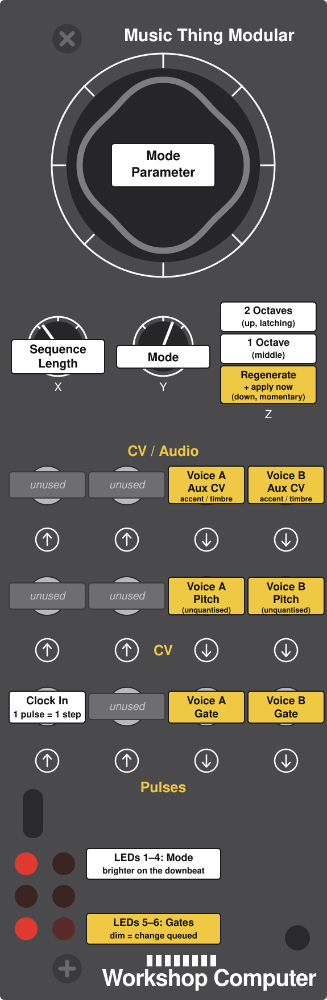

# gengengen

A four-mode generative sequencer program card for the [Music Thing Modular
Workshop System **Computer**](https://www.musicthing.co.uk/Computer_Program_Cards/),
written in Rust with Embassy. Built for playing live raw/deep warehouse techno
with a modular system.

Pitch is **unquantised** — raw voltage, no scales, no note numbers. A random
voltage goes to the VCO and it plays whatever that is.

## Panel



## Controls

Externally clocked on **Pulse In 1**. One clock pulse is one step.

| Control | Function |
|---|---|
| **Y** knob | Mode select (4 positions) |
| **X** knob | Sequence length, 1–16 steps |
| **Main** knob | Per-mode parameter (see below) |
| **Z** switch down | Regenerate — new voltages, now (momentary) |
| **Z** switch middle | 1 octave pitch range |
| **Z** switch up | 2 octave pitch range (latching) |

Mode and length changes take effect at the **next pattern boundary**, so turning
a knob mid-bar doesn't drop a gate in the wrong place. Switch-down is the "do it
now" override.

### Outputs

Two output sets, so two voices — see the panel above for which jack is which.

Pitch comes out of the jacks labelled **CV**, matching the Turing Machine and
Simple MIDI cards, so you can swap cards without repatching the rack. The aux CV
is accent or timbre depending on how you patch it.

That pair is the right home for pitch on its own merits too: Music Thing
describes it as the panel's "precision control voltages for pitch", it is the
only pair the EEPROM calibration covers, and although the PWM is nominally
11-bit, dithering the duty cycle lets the output filter average successive
values into the gaps. At the main loop's update rate that is worth roughly 15
effective bits — about 0.3 cents, against 7 cents for an undithered 11-bit duty.

Three voices work fine on two sets: give two of them the same gate, and let one
read the aux CV as accent while the other reads it as timbre.

### LEDs

The top four show the current mode, pulsing brighter on the downbeat so there's a
visible tempo reference without spending an LED on it. The bottom two show the
voices' gates, lit dimly when a knob change is queued but hasn't landed yet — so
you can tell the knob registered before the sound changes.

## The four modes

Three danceable, one not. The non-danceable one is a transition tool, not a
throwaway: switch an incoming voice to Drone so it arrives as texture, bring it
up, then switch it to something danceable.

### 1. Euclid + Turing

Euclidean rhythm on the gates, random voltage per step. **Main** sets the number
of pulses. Voice B takes the same rhythm rotated by half the pattern, so the two
voices interlock rather than merely coexist.

Euclidean patterns use Bjorklund's algorithm, so a given pulse count sounds the
same here as on other Euclidean sequencers.

### 2. Arp-run

Inspired by the [Wirehead Basilisk](https://wireheadinstruments.com/basilisk).
Walks *runs* of a fixed voltage increment rather than picking isolated random
notes — which is what makes a line sound played rather than sampled from a
distribution. The increment is randomised per run, so some runs crawl
microtonally and others leap.

**Main** sets mean run length: at minimum it degenerates to random voltage (≈ a
Turing Machine), around the middle you get rolling 303-style lines, at maximum
long rising and falling sweeps. Runs that hit the end of the range fold back
rather than flattening out.

### 3. Call/response

Both output sets as two voices in dialogue. A plays the first half of the
pattern, B answers on the second, with B's voltage **inverted about the centre of
the range** — a rising call becomes a falling answer.

**Main** crossfades from strict alternation to full overlap.

### 4. Drone/Suspension

The breakdown. Gates mostly stop; what's left is long, sparse gates placed
irregularly rather than on a grid (even placement would just read as a slow
pulse), with the voltage gliding between held pitches instead of stepping.

**Main** sweeps from sparse events to fully held.

## Building

```sh
./build.sh
```

Runs the host tests, builds the firmware, and writes `gengengen.uf2`.

Requires the `thumbv6m-none-eabi` target:

```sh
rustup target add thumbv6m-none-eabi
```

### Flashing

1. Hold the **BOOT** button — it's behind the top knob, so pull the knob off
2. Connect USB; the Computer appears as a USB drive
3. Copy `gengengen.uf2` onto it, then eject
4. Tap the **reset** button next to the card slot

## Development

Tests run on the host, not the target:

```sh
cargo test --target x86_64-apple-darwin --lib   # or your host triple
```

The hardware-dependent code is confined to `src/hw/board.rs`, which is gated on
`target_arch = "arm"`. Everything else — voltage generation, Euclidean rhythm,
the four modes, the sequencer state machine, calibration parsing — is pure logic
with tests, so the parts that can be wrong in an *audible* way are checkable
without a module plugged in.

```
src/
  main.rs              task wiring, clock edges, LEDs
  hw/
    board.rs           Embassy peripheral setup (ARM only)
    pins.rs            GPIO pin map
    mux.rs             4052 mux addressing
    controls.rs        knob stretching, switch thresholds, hysteresis
    dac.rs             MCP4822 command words
    calibration.rs     EEPROM calibration parsing and fitting
    cv.rs              millivolts to calibrated PWM CV settings
  music/
    voltage.rs         unquantised pitch ranges
    euclid.rs          Bjorklund Euclidean rhythms
    rng.rs             xorshift32
    modes.rs           the four generators
  seq/
    engine.rs          clock, step state, boundary-quantised changes
    slew.rs            voltage glides
docs/
  panel.svg            the panel guide above; edit this, not a raster
tools/
  elf2uf2.py           ELF to UF2, because elf2uf2-rs rejects our ABI
```

`hw/` is effectively a board support package for the Workshop Computer. No BSP
crate exists for this module, so this is the first one; it's kept behind a clean
seam in case it's worth extracting later.

## Notes on the hardware

Things that cost time, recorded so they don't cost it again:

1. **Almost everything is inverted.** Pulse inputs, pulse outputs and the PWM CV
   outputs are all inverted at the GPIO. Pulse inputs also need the RP2040
   pull-up enabled — it biases the input transistor, and without it they don't
   read at all.
2. **The mux needs a settle delay** after switching address, before reading the
   ADC. Read immediately and you get a blend of two positions.
3. **PWM slices are shared.** The six LEDs pair onto three slices, and both CV
   outputs share one. A config write sets both channels of a slice, so each
   channel's current level has to be rewritten alongside its partner's.
4. **The EEPROM calibration describes the PWM CV outputs, not the SPI DAC.**
   This one cost real time: the block is per-unit, lives on the module rather
   than the card, and its fitted line is *inverted* (higher setting, lower
   voltage) because that is how the PWM circuit behaves. Applying it to the
   MCP4822 — which is linear and non-inverted — played every sequence upside
   down and squeezed a two-octave span into about a third of the DAC's codes.
   Pitch now goes through a plain linear map (`hw::dac::millivolts_to_code`) and
   the calibration is used for the aux CV outs, where it belongs. The only other
   Rust card for this module leaves calibration as a TODO entirely.
5. **`elf2uf2-rs` rejects our binary** with "Unrecognized ABI" — current Rust LLD
   emits `EI_OSABI = 3` (Linux) for bare-metal ARM, and the tool only accepts 0.
   `tools/elf2uf2.py` writes the UF2 directly instead.
6. **`.boot2` needs explicit placement** in `memory.x`. Declaring a BOOT2 region
   isn't enough — without a `SECTIONS` block putting the section there, it lands
   after `.data` and the image won't boot.

### Unverified

These are coded to the official hardware documentation and need checking against
real hardware:

- **X/Y knob mux addressing.** The hardware doc's 4052 truth table and the one
  known-good Rust card disagree — that card's author noted "X and Y appear to be
  swapped compared to how I read the logic table". We follow the doc; if X and Y
  read transposed, set `SWAP_XY` in `src/hw/mux.rs`.
- **Which panel jacks are the DAC outs vs the PWM outs**, i.e. whether the jacks
  labelled "pitch" are the precise circuit.
- **Audio in L/R naming** — ComputerCard's defines swap L and R relative to the
  hardware doc.

## References

- [Workshop_Computer](https://github.com/TomWhitwell/Workshop_Computer) —
  hardware docs, EEPROM map, official card releases
- [ComputerCard](https://github.com/TomWhitwell/Workshop_Computer/tree/main/Demonstrations%2BHelloWorlds/PicoSDK/ComputerCard)
  (Chris Johnson) — the de-facto C++ library, and the reference for DAC framing,
  calibration handling and mux sequencing even though this card doesn't use it
- [mtmws_cards](https://codeberg.org/briandorsey/mtmws_cards) (Brian Dorsey) —
  the only other known Rust/Embassy cards for this module
- [DESIGN.md](DESIGN.md) — why the modes are what they are

## License

MIT
